# STUDBUD - lreu0177

## Relevance to Design Brief

In response to the design brief of designing and developing a study app website that helps students to better manage their studying by focusing on improving task, time and content management, I created StudBud. This site incorporates features that directly respond to each of these user needs in a way that suits my specific target audience, undergraduate university students aged 17-25 years old. 

In assignment two, I conducted a thorough user research process with this group that led to these key insights: 

1. I find it difficult to stay on track of my studies because there are too many tasks to remember

2. I struggle to make the most out of my time and always find myself procrastinating

3. I feel like i'm constantly falling behind content and I can never seem to catch up 

4. I am overwhelmed and stressed by my studies which prevents me from studying at all 

These insights informed 3 user personas that would greatly benefit me in keeping the target audience in mind with every design decision: 

- Emma: The Perfectionist
- Jenna: The Procrastinator
- Jake: The Disorganised 

In order to address the unique needs and requirements of these personas and thus my target audience as a whole, I wanted StudBud to be efficient, intuitive and effortless throughout the whole experience. This is why I chose to make my features as simple as possible and use colour, text and alerts to help users navigate the site with ease. These choices can be seen in more detail below in the Iteration and Improvement section. 

I chose to keep the same colour scheme from my mockups as users responded well to these colours and theme during testing. They felt that it gave a "calming vibe" and "would help me to focus better". This is corroborated by Dr. Kate Lee's research study which proved green to be the best colour for long-term concentration and improving efficiency and focus. Colour theory also suggests that orange, when used in small amounts, is also provent to lift the mood and improve neural functioning. 

The site's single-page design was chosen to also help with make the site easier to navigate and use. Since it is such a simplistic design, with minimal features - as requested by users - I felt that this choice would be best suited in this context. This decision was also informed by secondary research (Justinmind, 2018) I conducted on the benefits of single page vs multi-page websites as well as asking users for their thoughts. A single-page website allows the user to intuitively scroll, as university students do with most of the apps they use, and to provide easy navigation and an inability to get 'lost'. It is also great for this type of site that contains features that could be used in tandem. This prevents users from needing to keep switching to different tabs or pages of the sites and can easily multitask, for example edit their Kanban board while also keeping an eye on the stopwatch timer.

## Iteration and Improvement

In order to continue iterating my website as I was developing it, I performed 3 intermittent usability testing sessions with 5 participants at a time, that fit into my target user group. These testing sessions consisted of meeting with users in person and asking them to perform certain tasks on the site e.g. start and stop the stopwatch or move a task to 'completed' in the kanban board. Instead of guiding users, I observed as they tried to figure out each task which gave me excellent insight into how easy each action was to complete. I also used the 'think-aloud' method during this activity which enabled me to "gain a deep understanding of users' interactions and the reasoning that led to those interactions" (Tomitsch et al., 2018, p. 124). This was essential in figuring out what features needed to be iterated on and how might be best to do this.

Once I improved features based on one round of testing, I would conduct another round in order to see if these iterations helped the experience at all and if they solved key user pain points. If I made any more changes based on this feedback I would conduct another round of usability testing.

### Layout

### Stopwatch

The image below is the stopwatch I presented in my mockups in assignment two. After the first session of testing with users, a few of them seemed to get confused between the stop icon and reset icon and kept choosing the wrong one. Users exclaimed "the reset icon in my mind is more of the stop button, as I always think a cross like that would be stop" and "I feel like the two lines are a pause button, but I have no idea what the X would do?". To confirm this as a key issue I looked at literature discussing design principles regarding icons and buttons and found that "icons are (often) hard to memorize and are often highly inefficient" (https://uxmyths.com/post/715009009/myth-icons-enhance-usability). This prompted me to change these icons into text buttons to improve recognition and make the experience of using this feature a lot quicker. 

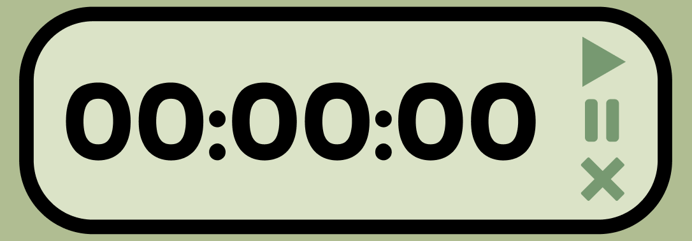

During the second round of user testing I developed the stopwatch shown below with the new text buttons. Users preferred this design and all correctly completed the task of starting, stopping and resetting the stopwatch with ease. However, some feedback recieved was "all the buttons look the same so it did take me a second to read them and choose" and "i think different coloured buttons would help me be quicker". Secondary research into this concept revealed that "button colour contrast" prevents users from making mistakes and helps guide their actions. (https://uxmovement.com/buttons/how-button-color-contrast-guides-users-to-action/)

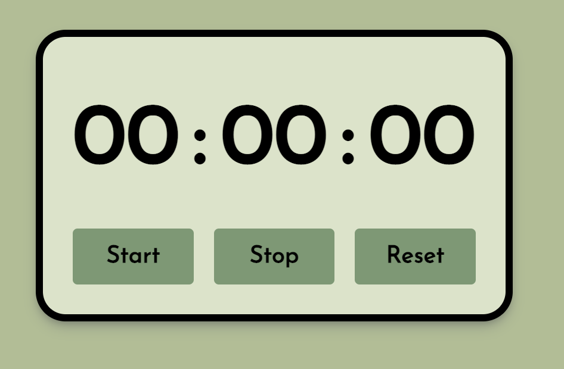

For the third round of testing I changed the colours of the buttons (as seen below) and found this to greatly help users during this session. I chose those specific colours after looking at inspiration of existing physical and digital products in order to see what was most commonly used. In doing so I would be able to follow the heuristic of 'recognition rather than recall' (https://www.nngroup.com/articles/ten-usability-heuristics/). 

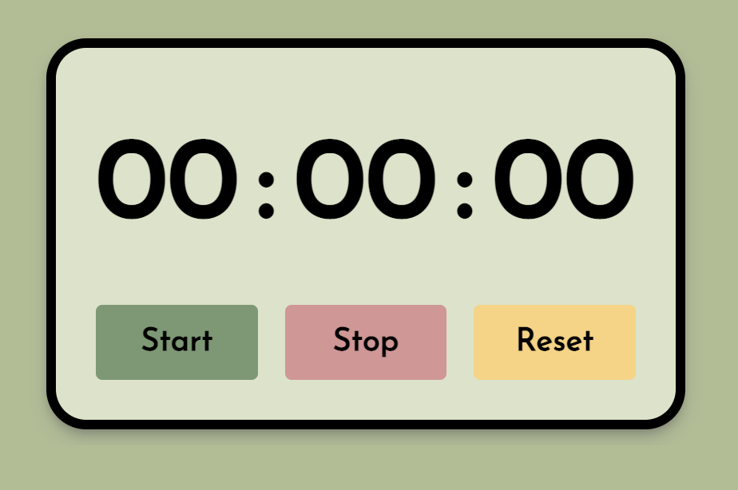

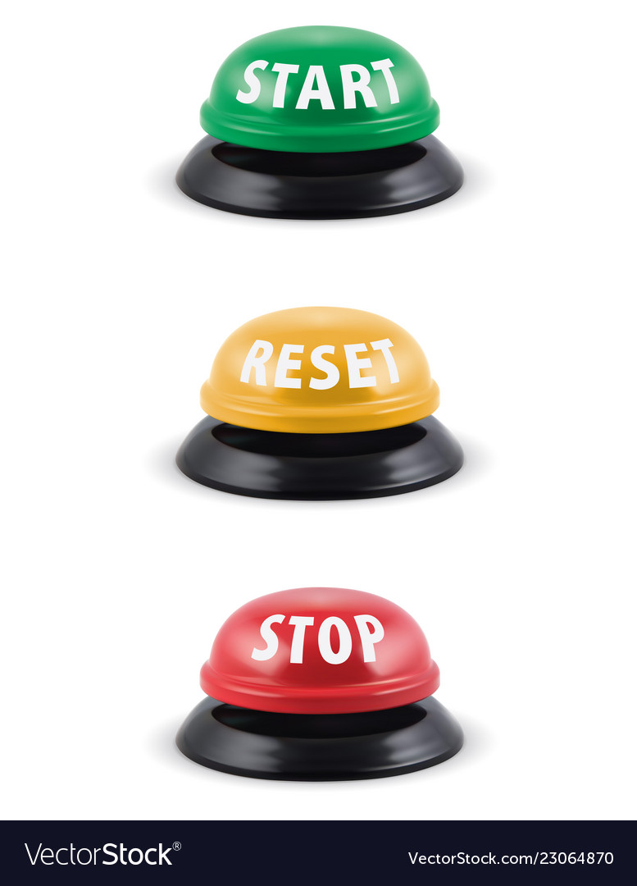
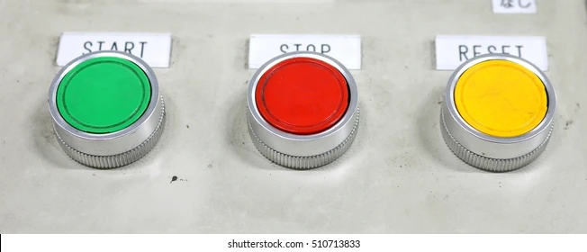

### Task List

### Kanban Board 
For my original mockup design (seen below) I chose to go with a simple layout using post-it note style boxes for each task. During the first testing session, users commented that they didn't understand why the squares were so big and that they felt they would add more than 4 tasks for each section during the busy weeks of the university semester. They felt that this would cause the board to become unneccessarily big and hard to see a complete overview within the screen. 

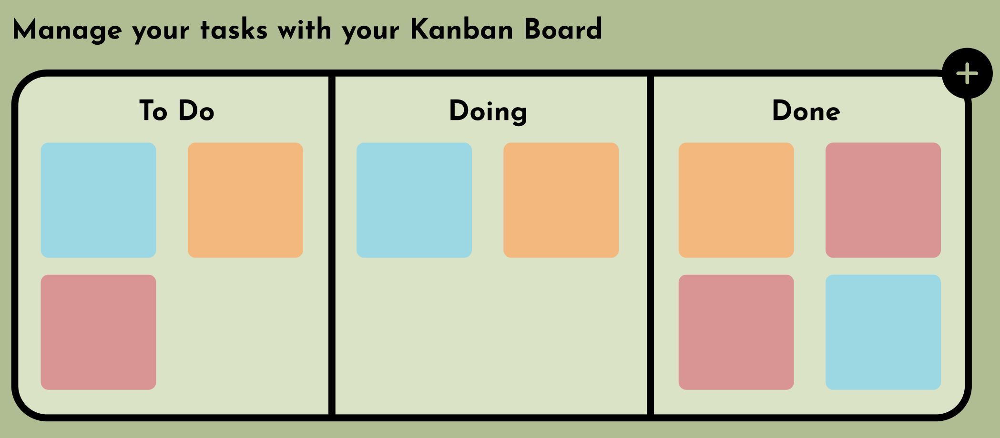

Responding to this feedback I ensured that the new kanban board would contain smaller boxes for assignments and be stacked on top of eachother to make it easier to read at a glance. Users responded well to these changes. I also followed the similar insight recieved during testing with the stopwatch timer and changed the add button from an icon to a clear text button below the board and under each column. 

In the second round of testing, I realised that some users were getting confused with the titles as they all sounded and looked too similar, 'to do', 'doing', 'done' - especially when in a rush to complete the task. I chose to use the new words seen below as I felt these would better represent each column, be more professional and of course easier to understand. Another discovery made during this session was that some participants found it difficult to move an item to a new column as they weren't placing it in the right spot and hence it would bounce back to it's original column. 

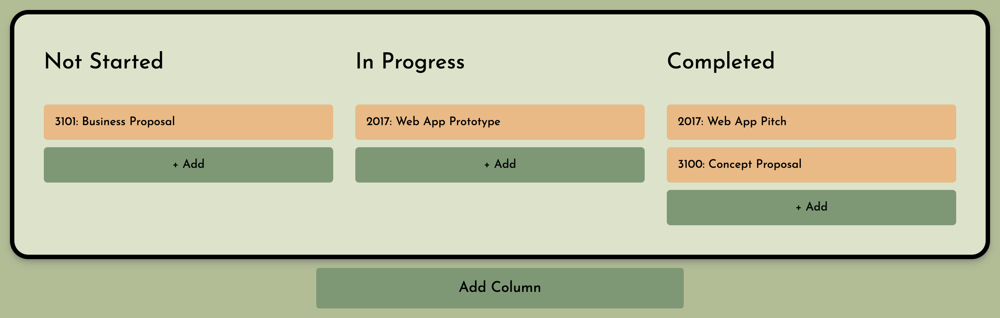

The third round of testing found that users liked the ability to drag and drop items and especially the new function of the 'dropzone' which guided them on where to place objects. This followed Nielsen's heuristic of Visibility of System Status which encourages keeping users informed about their interactions and what their next steps will be (https://www.nngroup.com/articles/ten-usability-heuristics/). 

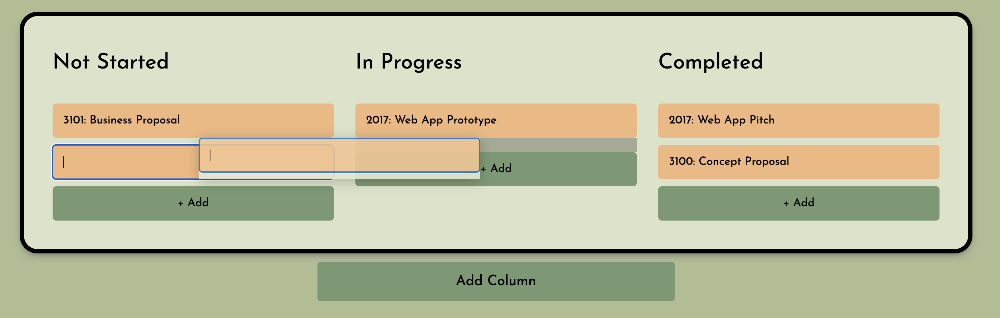

Lastly, the 'think-aloud' method led me to register that participants either didn't know how to delete or were deleting items by accident. To fix this I looked at design theory to find ways to fix this problem. I decided to put a piece of text that described to users exactly how to use the Kanban Board and especially how to delete (https://blog.tubikstudio.com/user-experience-tips-ux-writing/). 

To prevent users from mistakenly deleting an item I followed Nielsen's heuristic of error prevention that discusses alerting users of their action and giving them a chance to confirm it before making the mistake. This was solved with a pop-up that appears at the top of the screen when the user double clicks on an item, asking them if they are sure that this is the action they want to take. (https://www.nngroup.com/articles/ten-usability-heuristics/). 

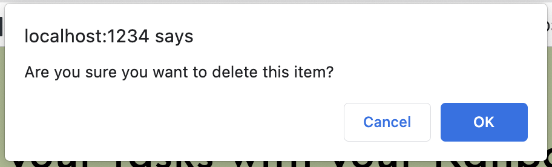

### Dictionary Lookup

Although in my mockups I had originally proposed a reading list creator, after speaking to users in the inital testing stage, we came to the conclusion that they would use a dictionary lookup more often and that this feature would be useful. They felt that they could already visit Canvas (or equivalent) and easily view readings by week there and didn't see the purpose of having this again on StudBud. Upon self-reflection I agreed with this feedback and as a university student myself I know that I do always use google as a dictionary lookup as I don't currently have a better solution, however this way is no where near efficient or effective and often results in me having a thousand tabs open that are impossible to find after. 

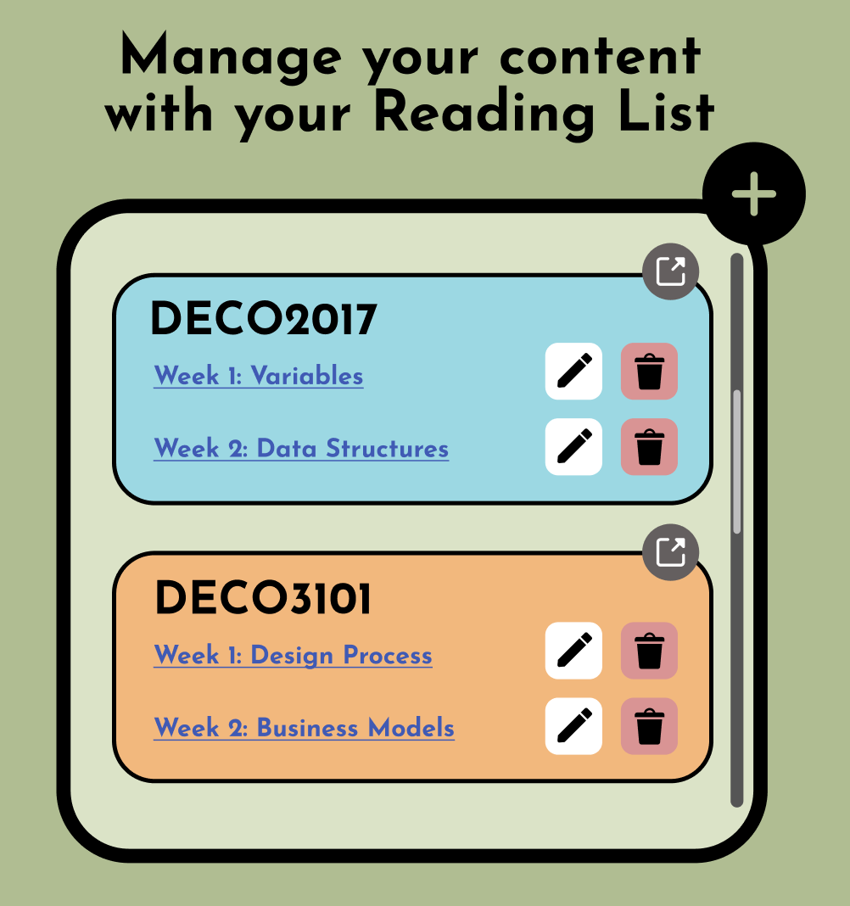

In response to this helpful feedback I switched the reading list creator for the dictionary lookup feature.

After the second round of testing, users reaffirmed their previous thoughts and exclaimed how much they liked this new feature. However, they felt that it could be improved by adding the ability to see pronunciation and an example of the word in order to help them better understand how they can use it and how they should say it, for presentations or video voice-overs. I implemented these aspects into the feature which recieved a stellar response from users in the third round of testing. 

Since I hadn't created a mockup of this feature I decided to follow the style of other features on the site to maintain consistency and the aesthetic. 

### Pomodoro Timer

During the first round of testing for the pomodoro timer feature, users were shown the mockup below and asked to start, stop and reset the timer. 

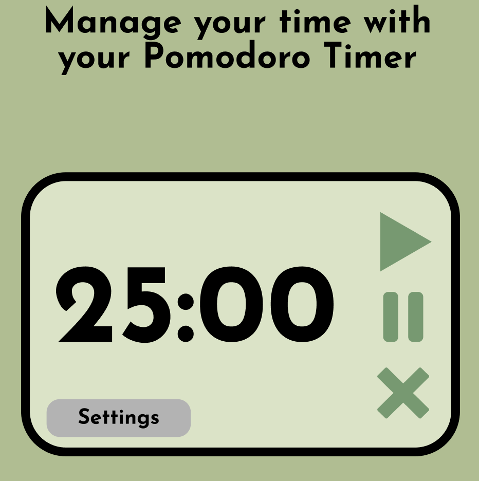

Most participants experienced the same issue that they had with the stopwatch timer (see above), where they found it difficult to distinguish the actions each icon button took. In response to this I replicated the new buttons featuring words created for the stopwatch timer and replaced the icon buttons with them. However, I felt that for this feature it would be beneficial to have a resume button, in case users wanted to resume a pomodoro session they had stopped. 

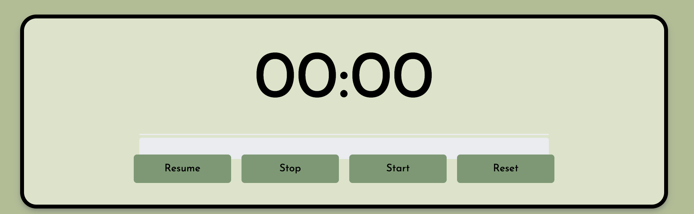

In the second round of testing, users again felt the same as they did before with the colour contrast of buttons. For consistency I chose to use the same colours for the same buttons, in order to make the user experience as easy as possible. For the resume button I again looked at precedents and common colours associated with this action. My conclusion from this was to use blue for this button. 

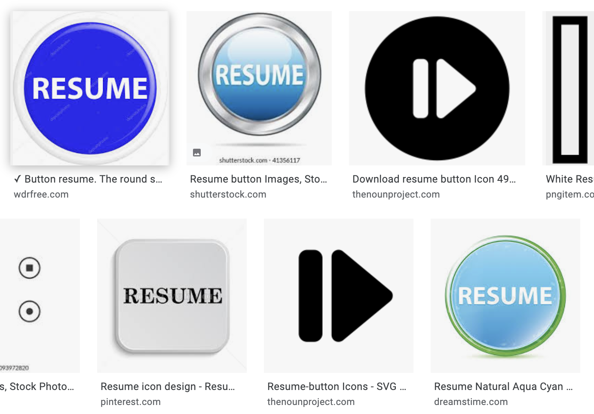

Another improvement made during this iteration round was to change the order of the buttons. While observing the user testing sessions I discovered that participants were automatically reaching to click the first button to 'start' but then being confused when they realised this was the 'resume' button. Some comments also alerted me to this issue during the 'think-aloud' method such as "oh i did not expect that button to be here" and "I feel like start should be first as that's the first thing I do". Lastly, I observed that participants would go to click the buttons first before filling in the input fields. To improve this, I followed Nielsen's heuristic of error prevention and added a message in red to alert users of how to properly use this feature (https://www.nngroup.com/articles/ten-usability-heuristics/).

These were excellent discoveries and fixing these pain points greatly improved the usability of this feature seen during the third round of testing. 

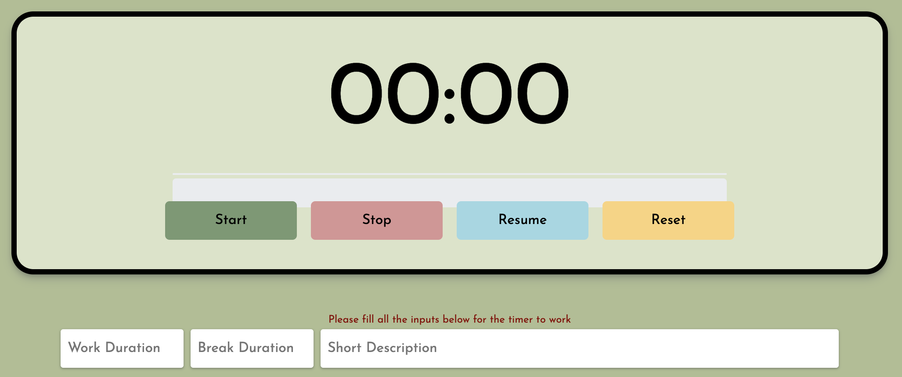

### Music Player

The first round of testing for this feature consisted of users being asked to play a song, pausse it and skip it. Users found this particularly easy to do, but stated that they weren't sure what some of the extra icons would do. After speaking more to users I also felt that the volume bar didn't really serve as much of a purpose and if anything was just taking up space, as users could just adjust the volume on their computer. 

In response to this I chose an embedded music player that closely resembled my mockups but that didn't have too many features present and would thus be easier to use. My mockup for this feature was also inspired by the music player in the Spotify desktop app, hence making the spotify embedded music player the perfect choice!

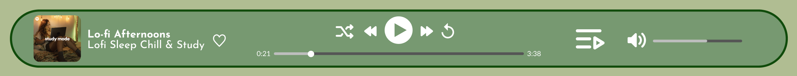

Spotify is the most popular music streaming platform amongst my target user group, with a recent survey conducted by BYU-Hawaii finding that 65.5% of students used Spotify more than any other service. (https://kealakai.byuh.edu/survey-shows-students-prefer-spotify-for-streaming-music-apple-music-is-runner-up#:~:text=Apple%20Music%20is%20considered%20by,Spotify%20was%20launched%20in%202008.) This is primarily due to Spotify's sleek design that appeals to young people as well as their decision to offer a discount to students. Because of this, I chose to embed a Spotify music player into this website. This also enables the user to play their own playlists, ones that that they have personally created, filled with songs they love and tailored to suit a certain mood. In doing so, users would be more likely to use this player instead of disregarding it and playing spotify externally. 

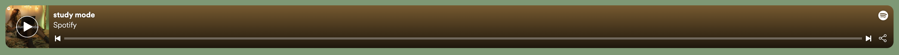

There were some inquiries into those users that do not have a spotify account, but not to worry! This embedded player has a default playlist set, that anyone can listen to when using the site. I chose this study playlist, as it is the one presented in my mockups and suits the theme of the site. 

#### Reflection

"Design shows relevant iteration based on feedback and further self-reflection."

NOTE: I had to restart my github as I ran into issues with git.ignore in my old one and could not fix it- hence why the dates of commits are recent and commits are separate files i moved over from my old repository 